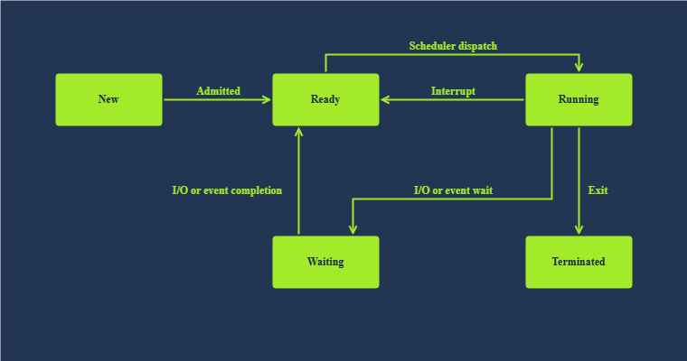
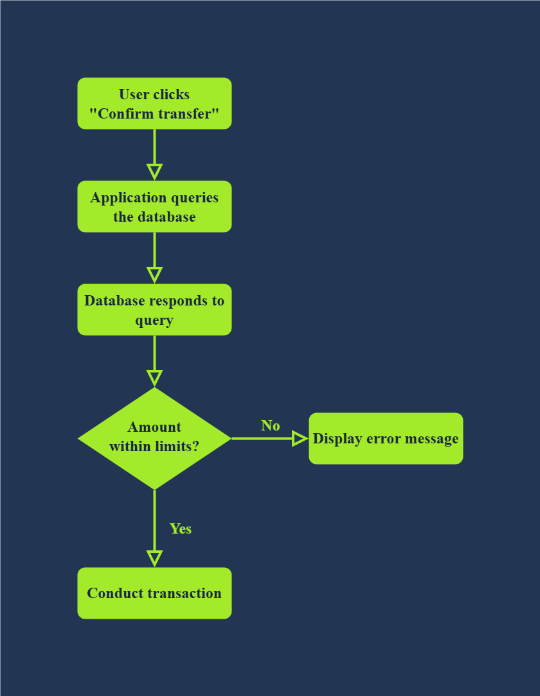

# Race Conditions
## Task1: Introduction
This room introduces the race conditions vulnerability. A race condition is a situation in computer programs where the timing of events influences the behaviour and outcome of the program. It typically happens when a variable gets accessed and modified by multiple threads. Due to a lack of proper lock mechanisms and synchronization between the different threads, an attacker might abuse the system and apply a discount multiple times or make money transactions beyond their balance.
### Learning Objectives
* Race conditions vulnerability
* Using Burp Suite Repeater to exploit race conditions
* Threads and multi-threading
* State diagrams
### Learning Prerequisites
To follow this room, we recommend familiarity with the HTTP protocol, web applications, and Burp Suite. The following rooms and modules are recommended to fill any knowledge gaps.
## Task2: Multi-Threading
### Programs
A program is a set of instructions to achieve a specific task. You need to execute the program to accomplish what you want. Unless you execute it, it won’t do anything and remains a set of static instructions.
### Processes
While in the “process” of “executing” the “instructions,” you might get interrupted by an urgent call. Or you might work on another “job” while waiting for the water to heat. Interruptions and waiting are generally unavoidable.

A process is a program in execution. In some literature, you might come across the term job. Both terms refer to the same thing, although the term process has superseded the term job. Unlike a program, which is static, a process is a dynamic entity. It holds several key aspects, in particular:

* Program: The executable code related to the process
* Memory: Temporary data storage
* State: A process usually hops between different states. After it is in the New state.
    i.e., just created, it moves to the **Ready state**.
    i.e., ready to run once given CPU time. Once the CPU allocates time for it, it goes to the **Running state**.
    Furthermore, it can be in the **Waiting state** pending I/O or event completion. Once it exits, it moves to the **Terminated state**.
    
### Threads
A thread is a lightweight unit of execution. It **shares various memory parts and instructions** with the process.

In many cases, we need to replicate the same process repeatedly. Think of a web server serving thousands of users the same page (or a personalized page). We can adopt one of two main approaches:

* Serial: One process is running; it serves one user after the other sequentially. New users are enqueued.
* Parallel: One process is running; it creates a thread to serve every new user. New users are only enqueued after the maximum number of running threads is reached.
    The previous app can run with four threads using Gunicorn. Gunicorn, also called the “Green Unicorn”, is a Python WSGI HTTP server. WSGI stands for Web Server Gateway Interface, which bridges web servers and Python web applications. In particular, Gunicorn can spawn multiple worker processes to handle incoming requests simultaneously. By running gunicorn with the --workers=4 option, we are specifying that we want four workers ready to tackle clients’ requests; moreover, --threads=2 indicates that each worker process can spawn two threads.

### Concurrency Model

The application uses multiple workers and threads to handle incoming HTTP requests. Although only one process can bind to a specific TCP port, the server can handle multiple requests concurrently using threads. Each request is processed in a separate thread, allowing multiple operations to occur simultaneously. This concurrency model introduces the possibility of race conditions when shared resources are accessed without proper synchronization.
Answer the questions below
You downloaded an instruction booklet on how to make an origami crane. What Question:would this instruction booklet resemble in computer terms?
Answer: Program
### 
Question:What is the name of the state where a process is waiting for an I/O event?

Answer: waiting
## Task3: Race Condition
### Real World Analogy

A race condition occurs when multiple threads access and modify shared data concurrently, leading to unpredictable results depending on execution timing.

A common form of race condition is the ***Time-of-Check*** to ***Time-of-Use*** (TOCTOU) vulnerability.

In a TOCTOU scenario, a value is checked (e.g., verifying account balance), but before the action is performed (e.g., withdrawing money), another thread modifies the value.

This creates a window where multiple operations can proceed based on outdated information, leading to inconsistent or incorrect outcomes.

For example, two concurrent requests may both verify sufficient balance and proceed with withdrawals, even though only one should be allowed.
### Causes

Concurrency + Shared Resource + No Synchronization = Race Condition

* Parallel Execution: Web servers may execute multiple requests in parallel to handle concurrent user interactions. If these requests access and modify shared resources or application states without proper synchronization, it can lead to race conditions and unexpected behaviour.
* Database Operations: Concurrent database operations, such as read-modify-write sequences, can introduce race conditions. For example, two users attempting to update the same record simultaneously may result in inconsistent data or conflicts. The solution lies in enforcing proper locking mechanisms and transaction isolation.
* Third-Party Libraries and Services: Nowadays, web applications often integrate with third-party libraries, APIs, and other services. If these external components are not designed to handle concurrent access properly, race conditions may occur when multiple requests or operations interact with them simultaneously.
### 
Answer the questions below

Question: Does the presented Python script guarantee which thread will reach 100% first? (Yea/Nay)

Answer: Nay

Question: In the second execution of the Python script, what is the name of the thread that reached 100% first?

Answer: Thread-1

## Task4: Web Application Architecture
### client-Server Model

Web applications follow a client-server model:

- Client: The client is the program or application that initiates the request for a service. For example, when we browse a web page, our web browser requests the web page (file) from a web server.

- Server: The server is the program or system that provides these services in response to incoming requests. For instance, the web server responds to an incoming HTTP GET request and sends an HTML page (or file) to the requesting web browser (client).

Generally speaking, the client-server model runs over a network. The client sends its request over the network, and the server receives it and processes it before sending back the required resource.

### Typical Web Application

A web application follows a multi-tier architecture. Such architecture separates the application logic into different layers or tiers. The most common design uses three tiers:

- Presentation tier: In web applications, this tier consists of the web browser on the client side. The web browser renders the HTML, CSS, and JavaScript code.
- Application tier: This tier contains the web application’s business logic and functionality. It receives client requests, processes them, and interacts with the data tier. It is implemented using server-side programming languages such as Node.js and PHP, among many others.
- Data tier: This tier is responsible for storing and manipulating the application data. Typical database operations include creating, updating, deleting, and searching existing records. It is usually achieved using a database management system (DBMS); examples of DBMS include MySQL and PostgreSQL.
### States

Let’s visit some examples from business logic before diving deeper. We will consider the following examples:

- Validating and conducting money transfer
- Validating coupon codes and applying discounts
### Validating and Conducting Money Transfer

Consider the example of transferring money to a friend or your other account. The program will progress as follows:

- 1. The user clicks on the “Confirm Transfer” button
- 2. The application queries the database to confirm that the account balance can cover the transfer amount.
- 3. The database responds to the query
        If the amount is within the account limits, the application conducts the transaction
        If the amount is beyond the account limits, the application shows an error message

A race condition occurs when multiple requests are processed at the same time during a small time window, allowing the same action to be performed more than once.

### 

Question: How many states did the original state diagram of “validating and conducting money transfer” have?

Answer: 2

Question: How many states did the updated state diagram of “validating and conducting money transfer” have?

Answer: 3

Question: How many states did the final state diagram of “validating coupon codes and applying discounts” have?

Answer: 5

## Task5: Exploiting Race Conditions
# Race Condition

Race condition happens when multiple requests exploit the gap between checking and updating data.  

In this lab, the application checks the balance first and then performs the transfer. By capturing the transfer request in Burp Suite and sending multiple duplicated requests in parallel using Repeater, all requests were processed before the balance was updated.  

As a result, multiple transfers succeeded at the same time, allowing the balance to exceed the intended limit. 
### 

Question: You need to get either of the accounts to get more than $100 of credit to get the flag. What is the flag that you obtained?

Answer: flag{YOUR_FLAG}

## Task6: Detection and Mitigation
### Detection

Race conditions are difficult to detect because they often occur within very small time windows and may not be visible during normal usage.

From a business perspective, such issues may go unnoticed unless logs are actively monitored for unusual behavior, such as:
- Multiple uses of a one-time coupon
- Multiple transactions within a short time frame

For penetration testers, the process involves:
- Understanding normal application behavior and restrictions (e.g., “use once”, “limit by balance”)
- Identifying possible race windows between validation and execution
- Attempting to bypass these controls using concurrent requests

Tools like Burp Suite Repeater can be used to simulate multiple simultaneous requests and identify race condition vulnerabilities.

### Mitigation

Several techniques can be used to prevent race conditions:

- Synchronization (Locks): Ensure only one process can access a shared resource at a time
- Atomic Operations: Execute critical operations as a single, indivisible step
- Database Transactions: Use transactions to guarantee consistency and prevent concurrent modification issues

These mechanisms ensure that validation and state updates happen safely without interference from other requests.

## Task7: Challenge Web App

The same race condition technique was applied. Create a request group on Repeater then send them parallel

###

Question: What flag did you obtain after getting an account’s balance above $1000?

Answer: THM{BANK-RED-FLAG}

## Summary

The exploitation process is straightforward:

1. Identify a sensitive action (e.g., transfer money)
2. Capture the POST request using Burp Suite
3. Send the request to Repeater
4. Duplicate the request multiple times (10–20)
5. Send all requests in parallel
6. Observe that multiple requests succeed due to the time gap between validation and execution

This confirms a race condition vulnerability, where concurrent requests bypass logical checks and lead to unintended behavior.